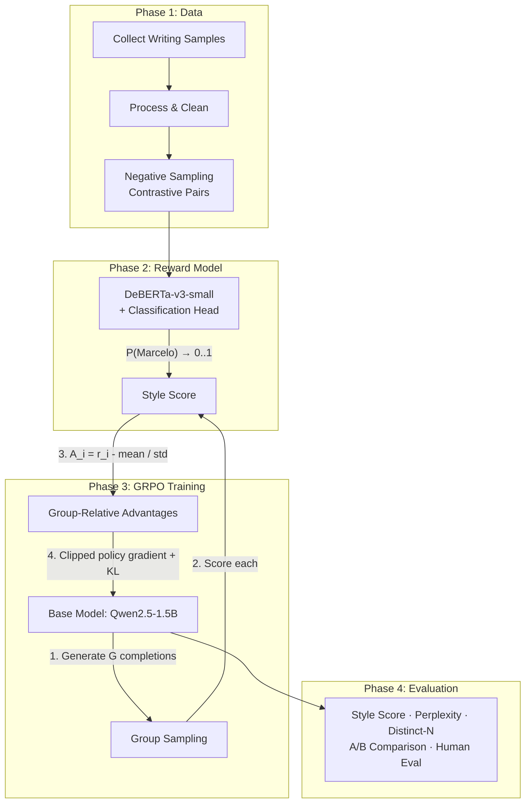

<p align="center">
  
  <h1 align="center">MarceLLo</h1>
</p>

<p align="center">
  Trained with peoms and posts. MarceLLo is an LLM dedicated to capturing my writing style. Research ongoing
</p>

## Concept

Standard fine-tuning (SFT) memorizes examples. MarceLLo uses **GRPO** (Group Relative Policy Optimization) to let the model *discover* writing style through reinforcement learning, guided by a style classifier as reward signal.

Same technique DeepSeek used for R1 — but the reward is "how much does this sound like Marcelo" instead of "is this reasoning correct."

## Architecture



## GRPO Key Insight

**GRPO** eliminates the need for a separate value/critic model:

1. Generates a **group** of G outputs for the same prompt
2. Scores all G outputs with the reward model
3. Uses the **group mean** as baseline (no learned value function)
4. Computes advantages: `A_i = (r_i - mean(r)) / std(r)`
5. Updates policy with clipped surrogate objective + KL penalty

## Project Structure

```
marcello/
├── configs/
│   ├── classifier.yaml    # Style classifier hyperparams
│   ├── grpo.yaml           # GRPO training config
│   └── data.yaml           # Data pipeline config
├── src/marcello/
│   ├── data/               # Collection, processing, negative sampling
│   ├── classifier/         # Style classifier (reward model)
│   ├── grpo/               # GRPO trainer, reward wrapper, sampling
│   ├── eval/               # Metrics, comparison, reporting
│   └── utils/              # Logging, helpers
├── scripts/                # Entry points for each phase
├── tests/                  # Unit tests
└── data/                   # Raw and processed datasets
```

## Quick Start

```bash
# Install
pip install -e ".[dev]"

# Place writing samples in data/raw/writing_samples/ (.txt or .jsonl)

# Process data and generate contrastive pairs
python scripts/collect_data.py --config configs/data.yaml

# Train the style classifier (reward model)
python scripts/train_classifier.py --config configs/classifier.yaml

# Run GRPO training
python scripts/train_grpo.py --config configs/grpo.yaml

# Evaluate
python scripts/evaluate.py --model outputs/grpo/final --prompts data/eval_prompts.txt
```

## Models

| Component | Model | Why |
|-----------|-------|-----|
| Style Classifier | `microsoft/deberta-v3-small` | Strong text classification, small footprint |
| Base LLM | `Qwen/Qwen2.5-1.5B` | Good quality at trainable size, fits on free GPUs |
| Negative Sampling | Same base LLM | Rephrase Marcelo's text in generic style |

## Resources

- [GRPO Paper (DeepSeek-Math)](https://arxiv.org/abs/2402.03300)
- [DeepSeek-R1 Technical Report](https://arxiv.org/abs/2501.12948)
- [TRL GRPOTrainer](https://huggingface.co/docs/trl/main/en/grpo_trainer)
- [DeBERTa-v3](https://huggingface.co/microsoft/deberta-v3-small)
