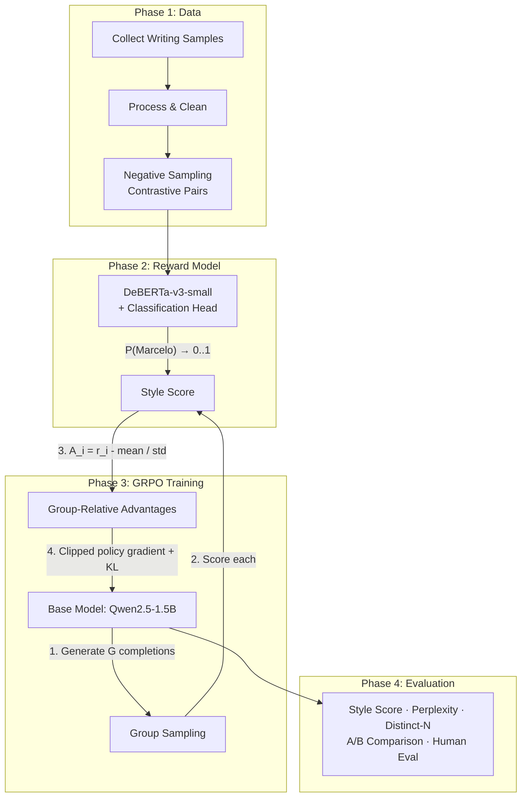

<p align="center">
  
  <h1 align="center">MarceLLo</h1>
</p>

<p align="center">
  Trained with poems and posts — an RL-based style transfer system that fine-tunes an LLM to capture my writing style. Research ongoing.
</p>

## Concept

Standard fine-tuning (SFT) memorizes examples. MarceLLo uses **GRPO** (Group Relative Policy Optimization) to let the model *discover* writing style through reinforcement learning, guided by a style classifier as reward signal.

Same technique DeepSeek used for R1 — but the reward is "how much does this sound like Marcelo" instead of "is this reasoning correct."

## Architecture


```mermaid
graph TD
    subgraph "Phase 1: Data"
        A[Collect Writing Samples] --> B[Process & Clean]
        B --> C[Negative Sampling<br/>Contrastive Pairs]
    end

    subgraph "Phase 2: Reward Model"
        D[DeBERTa-v3-small<br/>+ Classification Head]
        D -->|"P(Marcelo) → 0..1"| E[Style Score]
    end

    subgraph "Phase 3: GRPO Training"
        F[Base Model: Qwen2.5-1.5B]
        F -->|"1. Generate G completions"| G[Group Sampling]
        G -->|"2. Score each"| E
        E -->|"3. A_i = r_i - mean / std"| H[Group-Relative Advantages]
        H -->|"4. Clipped policy gradient + KL"| F
    end

    subgraph "Phase 4: Evaluation"
        I[Style Score · Perplexity · Distinct-N<br/>A/B Comparison · Human Eval]
    end

    C --> D
    F --> I
```

## GRPO Key Insight

**GRPO** eliminates the need for a separate value/critic model:

1. Generates a **group** of G outputs for the same prompt
2. Scores all G outputs with the reward model
3. Uses the **group mean** as baseline (no learned value function)
4. Computes advantages: `A_i = (r_i - mean(r)) / std(r)`
5. Updates policy with clipped surrogate objective + KL penalty

## Project Structure

```
marcello/
├── configs/
│   ├── classifier.yaml    # Style classifier hyperparams
│   ├── grpo.yaml           # GRPO training config
│   └── data.yaml           # Data pipeline config
├── src/marcello/
│   ├── data/               # Collection, processing, negative sampling
│   ├── classifier/         # Style classifier (reward model)
│   ├── grpo/               # GRPO trainer, reward wrapper, sampling
│   ├── eval/               # Metrics, comparison, reporting
│   └── utils/              # Logging, helpers
├── scripts/                # Entry points for each phase
├── tests/                  # Unit tests
└── data/                   # Raw and processed datasets
```

## Quick Start

```bash
# Install
pip install -e ".[dev]"

# Place writing samples in data/raw/writing_samples/ (.txt or .jsonl)

# Process data and generate contrastive pairs
python scripts/collect_data.py --config configs/data.yaml

# Train the style classifier (reward model)
python scripts/train_classifier.py --config configs/classifier.yaml

# Run GRPO training
python scripts/train_grpo.py --config configs/grpo.yaml

# Generate with the GRPO adapter
python scripts/generate.py --model outputs/grpo/final --prompt "La ciudad no duerme cuando siente miedo." --format-prompts

# Evaluate
python scripts/evaluate.py --model outputs/grpo/final --prompts data/eval_prompts.txt --format-prompts --output outputs/eval/latest.json
```

## Models

| Component | Model | Why |
|-----------|-------|-----|
| Style Classifier | `microsoft/deberta-v3-small` | Strong text classification, small footprint |
| Base LLM | `Qwen/Qwen2.5-1.5B` | Good quality at trainable size, fits on free GPUs |
| Negative Sampling | Pre-written contrastive texts | Same topics, generic voice (no Marcelo style) |

## Pre-trained Weights

| Model | Hugging Face |
|-------|--------------|
| Style Classifier | [`marcelo-earth/marcello-style-classifier`](https://huggingface.co/marcelo-earth/marcello-style-classifier) |
| Fine-tuned LLM | [`marcelo-earth/marcello-qwen2.5-1.5b-grpo`](https://huggingface.co/marcelo-earth/marcello-qwen2.5-1.5b-grpo) |

To use the pre-trained models directly:

```python
from transformers import AutoModelForSequenceClassification, AutoModelForCausalLM, AutoTokenizer

# Style classifier
classifier = AutoModelForSequenceClassification.from_pretrained("marcelo-earth/marcello-style-classifier")

# Fine-tuned LLM
model = AutoModelForCausalLM.from_pretrained("marcelo-earth/marcello-qwen2.5-1.5b-grpo")
tokenizer = AutoTokenizer.from_pretrained("marcelo-earth/marcello-qwen2.5-1.5b-grpo")
```

## Inference

The GRPO model is trained with explicit style/language control tags. For best results, wrap raw prompts with the same template used during training:

```bash
python scripts/generate.py \
  --model outputs/grpo/final \
  --prompt "The night felt larger than the street below." \
  --format-prompts \
  --style standard
```

If your prompt file already contains control tags, omit `--format-prompts`.

## Resources

- [GRPO Paper (DeepSeek-Math)](https://arxiv.org/abs/2402.03300)
- [DeepSeek-R1 Technical Report](https://arxiv.org/abs/2501.12948)
- [TRL GRPOTrainer](https://huggingface.co/docs/trl/main/en/grpo_trainer)
- [DeBERTa-v3](https://huggingface.co/microsoft/deberta-v3-small)

## Kaggle Notebook

Full pipeline (data → classifier → GRPO → eval) in a single notebook, designed for a free T4 GPU:

[`notebooks/marcello_kaggle_pipeline.ipynb`](notebooks/marcello_kaggle_pipeline.ipynb)
